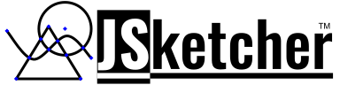

JSketcher
===========

KnitStitch is a **parametric** 2D sketching and constraint UI written in pure JavaScript, built from the JSketcher codebase.

This is the **Structured Chaos** fork of [xibyte/jsketcher](https://github.com/xibyte/jsketcher), hosted at [knitstitch.misssponto.me.uk](https://knitstitch.misssponto.me.uk/). The public site serves the 2D sketcher app at `/`; the 3D CAD front remains in the repo but is no longer the default KnitStitch surface.

The public pages use the shared Structured Chaos chrome (`css/shared.css`, `global-bar.js`, `site-header.js`). See [AGENTS.md](./AGENTS.md) and [docs/maintainer-notes.md](./docs/maintainer-notes.md) for fork-specific conventions and the runtime shape.

* [Workbench Dev Guide](./docs/index.md)
* [Architecture Overview](./docs/architecture.md)
* [Maintainer Notes](./docs/maintainer-notes.md)
* [Code Style](./docs/code-style.md)
* [Roadmap](./docs/roadmap.md)
* [Changelog](./docs/changelog.md)

Current Status
==============

KnitStitch keeps the JSketcher sketch constraint engine and the feature/history workflow, but the public experience is focused on 2D sketching and pattern work. The codebase still contains the broader CAD/3D engine where it is needed for shared geometry and import/export operations, but that front end is no longer the main entry point for this fork.

Major Components and features
==============
* Geometric Constraint Solver. This is a most crucial component which allows to solve a system of geometric constraints applied to a sketch. 
  See below the list of supported constraints.
* Sketch constraint tools for designing 2D profiles in the public KnitStitch UI.
* Geometry engine support remains available for import/export and shared modeling logic.
* Feature history remains available for sketch-based workflows and downstream geometry operations.
* Export to **STL**, **DWG** and **SVG** formats
* Saving projects in the browser locale storage
* Repository of dimensions. For example if there is a line length constraint applied, it's not necessary to hardcode some length value. 
  A dimension with a symbolic name can be created and the constraint can refer to that dimension by name. 
  Once value of dimension gets changed the sketch is resolved again accordingly to the new dimension values.  
* 2D measurement tool. Allows adding dimensions on a 2D drawing(Linear, Vertical, Horizontal and Arc/Circle dimension are supported)
* No any server-side needed. Only client side Javascript and wasm. 

This modeler is already used for:

* Designing 2D parametric sketches which can be exported to DWG or SVG format.
* Using the sketch engine as the front end for KnitStitch's pattern work.

Supported Constraints
=====================

* Coincident
* Vertical
* Horizontal
* Parallel
* Perpendicular
* Point to Line Distance
* Point to Object Distance
* Entity Equality(radius/length)
* Tangent
* Radius
* Point On Line
* Point On Arc / Ellipse
* Point In Middle
* Angle
* Symmetry
* Lock Convexity
* Fillet Meta Constraint

Get Started With the Code
=========================

Install node.js

* $ cd \<jsketcher folder\>
* $ npm install
* $ npm start

Local development runs on `http://localhost:3001`.

Production is static output from `dist/`, produced by `npm run build` (Grunt). In CloudPanel, create a static site and point the document root at `dist`; do not create a Node app for this frontend.

Contributing
=========================
TBC
